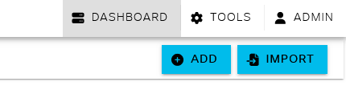

# Network Automation Series - Ansible Playbooks

This is a repository containing all the files used to create the network automation series on CML using Ansible.

## Download the CML Lab YAML file **(Requires CML 2.8)**

To download this lab, click here: [cml_lab.yaml](./CML_Lab/cml_lab.yaml).  When you open this link you will see an icon to download the file from the Github repository. (see Figure 1)

**Figure 1 - Download Icon**


Once you have the lab downloaded, log into your CML server and from the dashboard, select import (see Figure 2)

**Figure 2 - Import button**


From the import window, click in the grey bar for "Files to import" and browse for the cml_lab.yaml file you downloaded.  Double click the file to prepare it for import, then hit the blue import button.

** If you are running a CML version prior to Version: 2.8.0+build.6, this will fail, you must be running 2.8.0+build.6 or greater **

Once imported, follow the steps below to configure the Ubuntu host.

## CML Lab setup

The initial lab configuration for CML can be found in the CML Lab directory.  To access the Ubuntu host you need an IP address on your home network setup on the ENS2 interface.  Please make sure the current config of the Ubuntu host is accurate for your home network or the network your bridge0 interface in CML is configured to use. (see Figure 3)

**Figure 3 - Ubuntu ENS2 configuration**


The default username and password for all systems is 

* U: netadmin
* P: s3cr3tpw1

If you want to use a different user name, please update the node configuration for each device and change the startup configurations.  The node configuration can be found by clicking the node on the lab canvas, selecting config from the pop out screen, and locating the username and password configuration.  If you are not comfortable editting the node, boot the system up, log into the devices, and change the username configuration from the CLI.

**Figure 4 - Change node password (Router Example)**


To change password from Ubuntu CLI use **passwd** command from terminal, enter your desired password when prompted

For NX-OS, enter configure terminal, enter:
* username netadmin password *your_desired_password* role network-admin

For IOS-XE, enter configure terminal, enter:
* username netadmin privilege 15 secret *your_desired_password*

**Note** Failure to enter privilege 15 will force the netadmin account to SSH in "enable" mode and prevent the ansible from executing properly.  Handling this scenario has not been addressed in the video series, yet.

Once all your nodes boot up, confirm the following:

You can SSH from your PC/Mac/Linux host computer to the Ubuntu server.  Ideally, you should be using Visual Studio code to accomplish this, please watch this video if you wish to use VScode.

* Network Automation with Cisco Modeling Labs - Part 1, Initial Setup
https://www.youtube.com/watch?v=E7smeH7PJw0&t=206s

This video will walk you through setting up VScode to connect to the Ubuntu host.

## Clone this repository onto the Ubuntu host

From the Ubuntu "automation-jumphost" node, on the CLI, simply run the following command

```
git clone https://github.com/roguerouter/cml_ansible_automation.git
```

This will clone the repository to the Ubuntu node.  You are now ready to start working through the labs.  Please watch the video series if you'd like to understand how the content was built and how to start operating it.

* [Episode 2](https://youtu.be/lEqLMKUth8c?si=4Jz_oZftoTFi24qt): Covers the show_commands playbooks
* [Episode 3](https://youtu.be/aWOWPwgHAEI?si=6jBPM4phUge_Sea1): Covers the basic_system_config playbooks
* [Episode 4](https://youtu.be/zi19S_dp03U?si=RiUuCdCM0PXHj7mR): Covers the L3 interfaces, however the contents of this folder reflect the end result seen in Episode 5
* Episode 5: Covers L2 interfaces, and re-organizes the tasks and related files to be easier to manage.  This video releases Monday.
